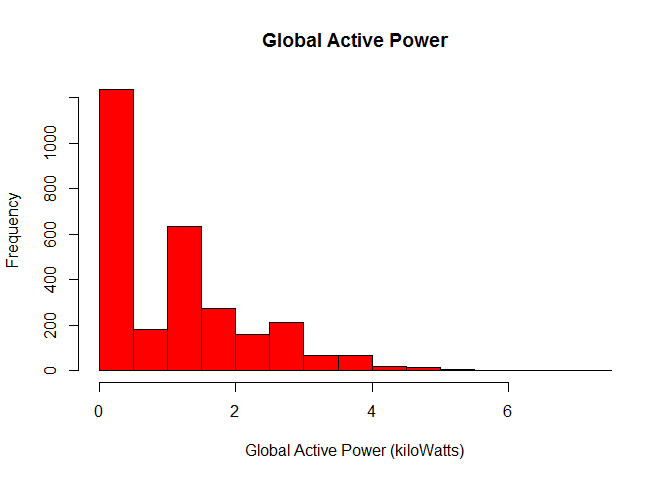
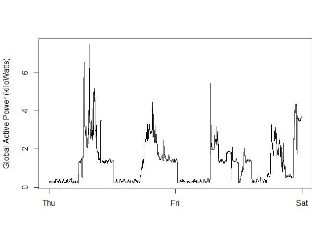
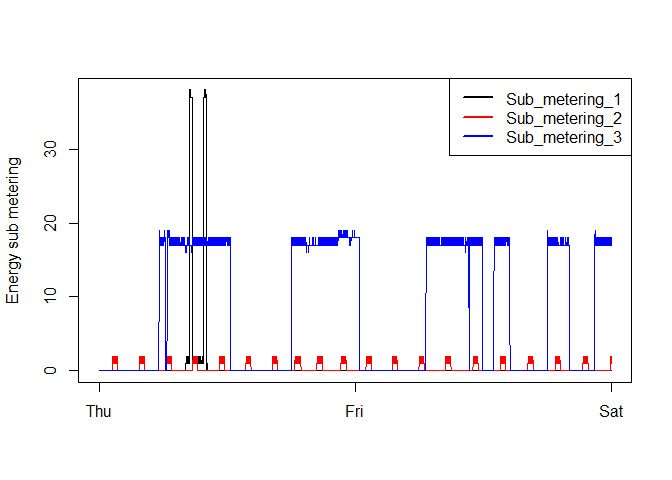
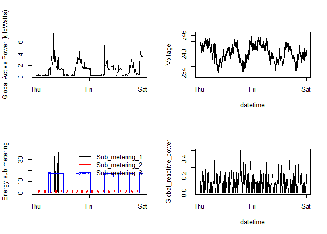

# Produce .png flies with plots to explore data.
Coursera student 75055  
Saturday, January 10, 2015  

 .

-------

# 1 - introduction

Here I fully document the steps taken to produce the results of project 1 of the Johns Hopkins Coursera course Exploratory Data Analysis of January 2015.
An description of the project can be found in the [readme.md](README.md)

 .

-------

# 2 - data processing

### step 1 - acquire data 

Download the data from the internet (see URL below) and unzip the data.  
See the the [UC Irvine Machine Learning Repository](https://archive.ics.uci.edu/ml/datasets/Individual+household+electric+power+consumption) for background information on the data.  
A large file is downloaded, so this might take a minute or two.  


```r
if (!file.exists("household_power_consumption.txt")) {
    url  = "https://archive.ics.uci.edu/ml/machine-learning-databases/00235/household_power_consumption.zip"
    dest = "rawdata.zip"
    meth = "internal"
    quit = TRUE
    mode = "wb"
    download.file(url, dest, meth, quit, mode)
    # NOTE this works under windows 7, modify if nessesairy
    unzip("rawdata.zip")
    # clean-up the environment
    rm(dest); rm(meth); rm(mode); rm(quit); rm(url)
} 
```

### step 2 - read, select and transform data

#### read data

read the acquired data into a data frame dat  
A large file is read, so this might take a minute or two.  


```r
dat <- read.table("household_power_consumption.txt"
                  , header = TRUE
                  , sep = ";"
                  , na.strings = "?"  # NOTE non-standard NA symbol
                  , stringsAsFactors = FALSE)
```

Have a look at the structure of the data frame  


```r
str(dat)
```

```
## 'data.frame':	2075259 obs. of  9 variables:
##  $ Date                 : chr  "16/12/2006" "16/12/2006" "16/12/2006" "16/12/2006" ...
##  $ Time                 : chr  "17:24:00" "17:25:00" "17:26:00" "17:27:00" ...
##  $ Global_active_power  : num  4.22 5.36 5.37 5.39 3.67 ...
##  $ Global_reactive_power: num  0.418 0.436 0.498 0.502 0.528 0.522 0.52 0.52 0.51 0.51 ...
##  $ Voltage              : num  235 234 233 234 236 ...
##  $ Global_intensity     : num  18.4 23 23 23 15.8 15 15.8 15.8 15.8 15.8 ...
##  $ Sub_metering_1       : num  0 0 0 0 0 0 0 0 0 0 ...
##  $ Sub_metering_2       : num  1 1 2 1 1 2 1 1 1 2 ...
##  $ Sub_metering_3       : num  17 16 17 17 17 17 17 17 17 16 ...
```
The Date variable must be of type Date, make it so.  
Note that the format is %d/%m/%Y  


```r
dat[,1] <- as.Date( dat[,1],format="%d/%m/%Y")
```

#### select rows to use

We only use the data of 2007-02-01 and 2007-02-02, create a data frame with rows for these dates only.  
Also remove rows with NA's in the row (the were not present, so we could skip this).


```r
dat1 <- dat[which(dat$Date == as.Date("2007-02-01") | dat$Date == as.Date("2007-02-02") ),]
row.names(dat1) <- NULL

dat1 <- na.omit(dat1) 
```

#### add column DateTime 

We need a DateTime column of type POSIXct to represent time.

First add a column with the appropriate dateTime string.  
Then add a column with the DateTime values.  


```r
# construct dateTime string
dat1[,10] <- paste0(dat1[,1]," ",dat1[,2])
names(dat1)[10] <- "dateTimeString"

# construct DateTime column
dat1[,11] <- as.POSIXct(dat1[,10],format="%Y-%m-%d %H:%M:%S")
names(dat1)[11] <- "DateTime"
```

### step 3 - construct the data frame pow

i.e. remove un-needed columns from dat1  
put the remaining columns in the right order, and   
save the result in data frame pow  

Then clean up the environment (remove un-needed data frames). 

Finally, show the structure of the data frame pow.


```r
pow <- dat1[,c(1,11,3:9)]

rm(dat); rm(dat1)

str(pow)
```

```
## 'data.frame':	2880 obs. of  9 variables:
##  $ Date                 : Date, format: "2007-02-01" "2007-02-01" ...
##  $ DateTime             : POSIXct, format: "2007-02-01 00:00:00" "2007-02-01 00:01:00" ...
##  $ Global_active_power  : num  0.326 0.326 0.324 0.324 0.322 0.32 0.32 0.32 0.32 0.236 ...
##  $ Global_reactive_power: num  0.128 0.13 0.132 0.134 0.13 0.126 0.126 0.126 0.128 0 ...
##  $ Voltage              : num  243 243 244 244 243 ...
##  $ Global_intensity     : num  1.4 1.4 1.4 1.4 1.4 1.4 1.4 1.4 1.4 1 ...
##  $ Sub_metering_1       : num  0 0 0 0 0 0 0 0 0 0 ...
##  $ Sub_metering_2       : num  0 0 0 0 0 0 0 0 0 0 ...
##  $ Sub_metering_3       : num  0 0 0 0 0 0 0 0 0 0 ...
```

### Step 4 - save analytic data in file power.csv

For future use and documentation, save the contents of the data frame pow in a file power.csv


```r
write.csv(pow, "power.csv", row.names=FALSE)
```

.

-------

# 3 - make plot1.png  

Make the plot


```r
hist(pow$Global_active_power, 
     col  = "red",
     main = "Global Active Power",
     xlab = "Global Active Power (kiloWatts)",
     xlim = c(0,7.5)  # set the range shown on the X-axix
                      # show everything between 0 and 7.5
    )
```

 

Copy the result to file plot1.png file  
(Note that the default width and height are 480)


```r
dev.copy(png, "plot1.png")
```

```
## png 
##   3
```

```r
dev.off() 
```

```
## pdf 
##   2
```

.

-------

# 4 - make plot2.png  

To get the English abriviations for the weekdays, set the local LC_TIME variable to English.


```r
Sys.setlocale("LC_TIME", "English_United Kingdom")
```

```
## [1] "English_United Kingdom.1252"
```

Make the plot


```r
plot(pow$DateTime, pow$Global_active_power, 
     type= "l",
     xlab = "",
     ylab = "Global Active Power (kiloWatts)",
     main = ""
)
```

 

Copy the result to file plot2.png file  
(Note that the default width and height are 480)


```r
dev.copy(png, "plot2.png")
```

```
## png 
##   3
```

```r
dev.off() 
```

```
## pdf 
##   2
```

 .

-------

# 5 - make plot3.png  

The previous two files were made using the dev.copy() function.  
To create enough room for the legend it was necessary to directly open a png device and write to it.

First create a function to produce the plot


```r
showPlot3 <- function(){
    #  make the basic plot
    plot( pow$DateTime, pow$Sub_metering_1,
          type= "l",
          col = "black",
          xlab = "",
          ylab = "Energy sub metering",
          main = ""
          )
    # add Sub_metering_2 line
    lines(pow$DateTime, pow$Sub_metering_2,
          col = "red"
          )
    # add Sub_metering_3 line
    lines(pow$DateTime, pow$Sub_metering_3,
          col = "blue"
          )
    # Add leggend
    legend("topright", 
           lty    = c(1,1,1),
           lwd    = c(2.5,2.5,2.5),
           col    = c("black","red","blue"), 
           legend = c("Sub_metering_1", "Sub_metering_2", "Sub_metering_3")
           )
}
```

Use the function to show the plot here

```r
showPlot3()
```

 

Create plot3.png, i.e.  
a) Open the graphics device png.  
...NOTE use pointsize 12 to create room for the legend.  
b) Use showPlot3() to write the plot to the graphics device.  
c) Close the graphics device.

PS have a look at the help of the png() function to see the defaults and the documentation of pointsize parameter.


```r
png(filename = "plot3.png", pointsize = 12)
showPlot3()
dev.off()
```

```
## pdf 
##   2
```

 .

-------

# 6 - make plot4.png  

To make plot4.png we can use the same approach we used to make plot3.png.

First create a function to produce the plot


```r
showPlot4 <- function(){
    #### make a 2 by 2 grid to put the four plots in #######
    par(mfrow = c(2, 2))
    
    #### make plot row 1, col 1 ##############
    plot(pow$DateTime, pow$Global_active_power, 
         type= "l",
         xlab = "",
         ylab = "Global Active Power (kiloWatts)",
         main = ""
         )
    
    #### make plot row 1, col 2 ##############
    plot(pow$DateTime, pow$Voltage, 
         type= "l",
         xlab = "datetime",
         ylab = "Voltage",
         main = ""
         )
    
    #### make plot row 2, col 1 ##############
    plot( pow$DateTime, pow$Sub_metering_1,
          type= "l",
          col = "black",
          xlab = "",
          ylab = "Energy sub metering",
          main = ""
          )
    lines(pow$DateTime, pow$Sub_metering_2,
          col = "red"
          )
    lines(pow$DateTime, pow$Sub_metering_3,
          col = "blue"
          )
    legend("topright", 
           lty    = c(1,1,1),
           lwd    = c(2.5,2.5,2.5),
           col    = c("black","red","blue"), 
           legend = c("Sub_metering_1", "Sub_metering_2", "Sub_metering_3"),
           bty    = "n"
           )
    
    #### make plot row 2, col 2 ##############
    plot(pow$DateTime, pow$Global_reactive_power, 
         type= "l",
         xlab = "datetime",
         ylab = "Global_reactive_power",
         main = ""
         )
}
```

Use the function to show the plot here.  
Note, the legend here is not OK, but the one in the png is.


```r
showPlot4()
```

 

Create plot4.png, i.e.  
a) Open the graphics device png.  
...NOTE use pointsize 12 to create room for the legend.  
b) Use showPlot4() to write the plot to the graphics device.  
c) Close the graphics device.


```r
png(filename = "plot4.png", pointsize = 12)
showPlot4()
dev.off()
```

```
## pdf 
##   2
```


